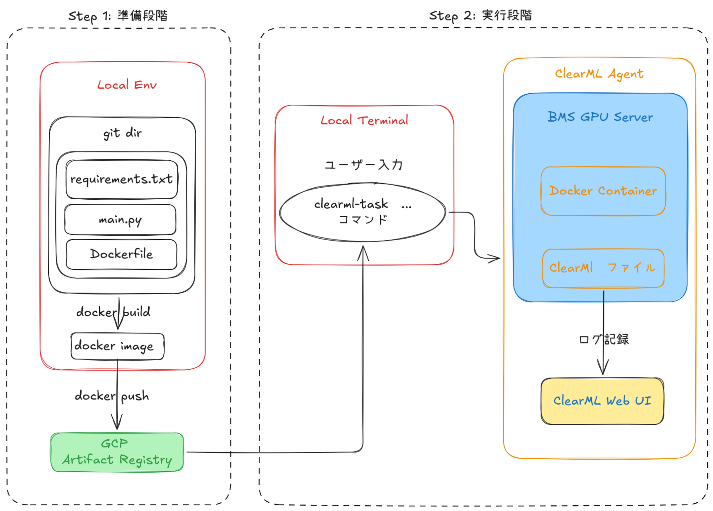

# ClearML GPU Test: GCP Artifact Registry + clearml-task 実行手順

## 目的

この手順では、`clearml-gpu-test` プロジェクトを以下の構成で実行します。

- Docker image を GCP Artifact Registry にアップロードする
- 毎回 GPU server 上で Docker build しない
- 手元PC、または会社ネットワーク内の端末から `clearml-task` で実験をキューに投入する
- 実際のGPU実行は、会社GPU server上の ClearML Agent に任せる
- Python 依存関係は `requirements.txt` で管理する

---

## 全体像

```
手元PC / 会社ネットワーク内の端末
  ↓ clearml-task
ClearML Server
  ↓ queue: blackwell-x1
会社GPU server上の ClearML Agent
  ↓ docker pull
GCP Artifact Registry
  ↓
Docker container 内で ClearML Agent が task 用環境を作成
  ↓
requirements.txt から依存関係をinstall
  ↓
main.py 実行
```

---

## 前提

この手順では以下を前提にします。

```bash
GCP_PROJECT_ID=bms-model-dev
REGION=asia-northeast1
ARTIFACT_REPO=clearml-gpu-test
IMAGE_NAME=clearml-gpu-test
IMAGE_TAG=latest
QUEUE_NAME=blackwell-x1
```

最終的な Docker image 名は以下になります。

```
asia-northeast1-docker.pkg.dev/bms-model-dev/clearml-gpu-test/clearml-gpu-test:latest
```

---

## Step 0: ローカルプロジェクトの準備

まだプロジェクトを作成していない場合のみ実行します。

```bash
mkdir clearml-gpu-test
cd clearml-gpu-test
```

以下のファイルを作成します。

```
clearml-gpu-test/
├── Dockerfile
├── main.py
└── requirements.txt
```

`requirements.txt` を作成します。

```
clearml>=1.16.0
torch>=2.2.0
```

---

## Step 1: `main.py` を作成する

```python
import argparse
import torch
from clearml import Task

def main():
    parser = argparse.ArgumentParser()
    parser.add_argument("--dataset-id", type=str, default="default_id")
    args = parser.parse_args()

    task = Task.init(
        project_name="GPU_Test_Project",
        task_name="sen_remote_run_test"
    )

    print(f"Dataset ID: {args.dataset_id}")
    print(f"Torch version: {torch.__version__}")
    print(f"CUDA Available: {torch.cuda.is_available()}")

    if torch.cuda.is_available():
        print(f"GPU Name: {torch.cuda.get_device_name(0)}")

if __name__ == "__main__":
    main()
```

---

## Step 2: `Dockerfile` を作成する

`uv` は使わないため、Dockerfile から `uv` 関連処理を削除します。

```docker
FROM python:3.10-slim

# OS dependencies
RUN apt-get update && apt-get install -y --no-install-recommends \
    libgomp1 git \
    && rm -rf /var/lib/apt/lists/*

WORKDIR /app

COPY . .

CMD ["python", "main.py"]
```

---

## Step 3: GCPへログインする

```bash
gcloud auth login
```

ログイン直後に、アクセス可能な GCP project を確認します。

```bash
gcloud projects list
```

使う project を設定します。

```bash
gcloud config set project bms-model-dev
```

現在の設定を確認します。

```bash
gcloud config list
```

---

## Step 3.5: 権限確認

この手順では、GCP Artifact Registry と GitHub repository の両方にアクセスする必要があります。

権限は大きく分けて以下の3つです。

### 1. 手元PCからArtifact Registryへ`push`する権限

`Docker image`をArtifact Registryへ`push`するユーザーには、対象repositoryに対する`write`権限が必要です。

対象:

```bash
projects/bms-model-dev/locations/asia-northeast1/repositories/clearml-gpu-test
```

必要なRole:

```bash
roles/artifactregistry.writer
```

確認:

```bash
gcloud artifacts repositories list --location=asia-northeast1
```

`push`時に以下のエラーが出る場合は、`write`権限が不足しています。

```bash
Permission 'artifactregistry.repositories.uploadArtifacts' denied
```

その場合は、管理者に依頼します。

### 2. ClearML AgentがArtifact Registryからpullする権限

ClearML AgentはGPU server上でDocker imageをpullして実行します。

そのため、GPU server側、またはClearML Agentが使用しているGCPアカウント / Service Account に、Artifact Registryからpullする権限が必要です。

必要なRole:

```bash
roles/artifactregistry.reader
```

GPU server側で以下が成功する必要があります。

```bash
docker pull asia-northeast1-docker.pkg.dev/bms-model-dev/clearml-gpu-test/clearml-gpu-test:latest
```

---

## Step 4: Artifact Registry repository を作成する

Docker image を保存するための Artifact Registry repository を作成します。

```bash
gcloud artifacts repositories create clearml-gpu-test \
  --repository-format=docker \
  --location=asia-northeast1 \
  --description="Docker images for clearml-gpu-test"
```

既に存在する場合は、以下のようなエラーが出ます。

```
ALREADY_EXISTS: the repository already exists
```

その場合は新規作成せず、既存 repository をそのまま使えばよいです。

repository 一覧を確認します。

```bash
gcloud artifacts repositories list --location=asia-northeast1
```

---

## Step 5: DockerからArtifact Registryへpushできるようにする

```bash
gcloud auth configure-docker asia-northeast1-docker.pkg.dev
```

確認を求められたら `Y` を入力します。

---

## Step 6: Docker imageをbuildする

```bash
docker build -t asia-northeast1-docker.pkg.dev/bms-model-dev/clearml-gpu-test/clearml-gpu-test:latest .
```

---

## Step 7: Docker imageをArtifact Registryへpushする

```bash
docker push asia-northeast1-docker.pkg.dev/bms-model-dev/clearml-gpu-test/clearml-gpu-test:latest
```

push 後、GCP Console の Artifact Registry で以下を確認します。

```
Artifact Registry
  → clearml-gpu-test
    → clearml-gpu-test
      → latest
```

---

## Step 8: ClearML設定を確認する

手元PCに `clearml.conf` があることを確認します。

```bash
ls ~/clearml.conf
# または
ls ~/.clearml/clearml.conf
```

ない場合は、ClearML Web UI から Credentials を発行し、ClearML の設定を行います。

通常は以下で初期設定できます。

```bash
clearml-init
```

---

## Step 9: GitHubにpushする

ClearML Agent は `--repo` で指定された GitHub repository を clone します。

そのため、以下のファイルが GitHub に push されている必要があります。

```
Dockerfile
main.py
requirements.txt
```

例:

```bash
git add Dockerfile main.py requirements.txt
git commit -m "Use requirements.txt for ClearML remote execution"
git push origin main
```

---

## Step 10: `clearml-task` で実験をキューに投入する

GitHub repository を使って、ClearML Agent に remote 実行させます。

```bash
clearml-task \
  --project GPU_Test_Project \
  --name sen_remote_run_test \
  --repo https://github.com/SennSann99/clearml-gpu-test.git \
  --branch main \
  --script main.py \
  --docker asia-northeast1-docker.pkg.dev/bms-model-dev/clearml-gpu-test/clearml-gpu-test:latest \
  --docker_args "--ipc=host --shm-size=8g" \
  --queue blackwell-x1 \
  --args dataset-id=test_dataset
```

`main.py` 側で以下のように定義しているため、

```python
parser.add_argument("--dataset-id", type=str, default="default_id")
```

`clearml-task` では以下で問題ありません。

```bash
--args dataset-id=test_dataset
```

---

## Step 11: 成功確認

ClearML Web UI で以下を確認します。

- Project: `GPU_Test_Project`
- Task: `sen_remote_run_test`
- Status: queued → running → completed
- Console log に以下が出ること

```
Dataset ID: test_dataset
Torch version: ...
CUDA Available: True
GPU Name: ...
```

---